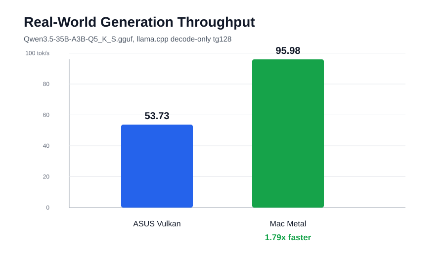
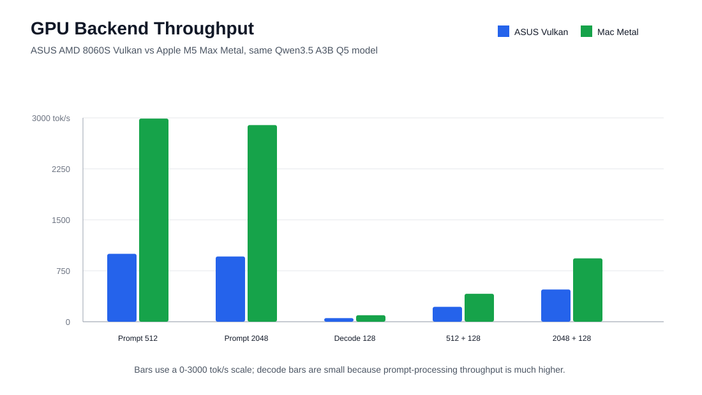
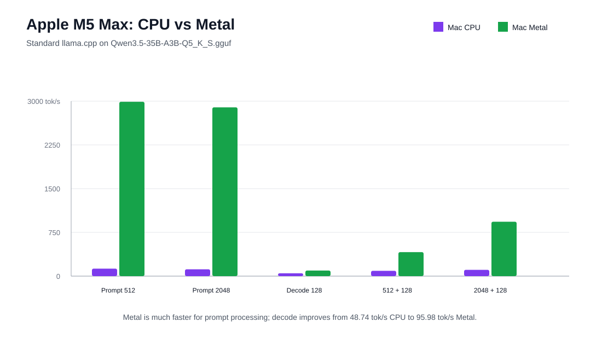

# Apple M5 Max vs ASUS ROG Flow Z13 llama.cpp Benchmark

This rep  contains a reproducible benchmark snapshot for standard `llama.cpp` on an Apple M5 Max MacBook Pro, compared with an existing ASUS ROG Flow Z13 / AMD Ryzen AI Max+ 395 baseline.

The headline result for end-user generation speed is:

**Apple M5 Max Metal: 95.98 tok/s decode**

**ASUS ROG Flow Z13 Vulkan: 53.73 tok/s decode**

That makes the Mac Metal run **1.79x faster** for decode/generation throughput on the same model and quant.

## Hardware

Mac benchmark machine:

- Machine: MacBook Pro, Mac17,7
- Chip: Apple M5 Max
- CPU cores: 18 total, 6 Super and 12 Performance
- GPU cores: 40
- Memory: 128 GB unified memory
- Backend: Metal

Raw hardware capture:

`results/hardware.txt`

## Model

Both the Mac results and ASUS baseline use:

`Qwen3.5-35B-A3B-Q5_K_S.gguf`

Downloaded from:

`https://huggingface.co/unsloth/Qwen3.5-35B-A3B-GGUF/resolve/main/Qwen3.5-35B-A3B-Q5_K_S.gguf`

`llama.cpp` reported:

`qwen35moe 35B.A3B Q5_K - Small`

## llama.cpp Build

Mac build:

- llama.cpp commit: `7c158fbb4`
- llama.cpp build number: `9518`
- Backends: `MTL,BLAS`
- CMake flags: `-DCMAKE_BUILD_TYPE=Release -DGGML_NATIVE=ON -DGGML_METAL=ON`
- Note: OpenMP was not found during CMake configure.

## Benchmark Matrix

- Prompt-only: `pp512`, `pp2048`
- Decode-only: `tg128`
- Mixed prompt/generation: `pp512+tg128`, `pp2048+tg128`
- Repetitions: `3`
- KV cache: `f16/f16`
- Flash Attention: enabled

CPU-only command shape:

```bash
MODEL=/path/to/Qwen3.5-35B-A3B-Q5_K_S.gguf \
LLAMA_BENCH=/path/to/llama-bench \
bash scripts/run_standard_llama_cpu.sh
```

Metal command shape:

```bash
MODEL=/path/to/Qwen3.5-35B-A3B-Q5_K_S.gguf \
LLAMA_BENCH=/path/to/llama-bench \
bash scripts/run_standard_llama_metal.sh
```

## Methodology And Credibility

These are `llama.cpp` backend throughput results. They are useful for comparing local inference performance between the tested CPU/GPU backends, especially because the final Mac run and ASUS baseline use the same model and quant.

What the benchmark does well:

- Uses the same model/quant for the final comparison: `Qwen3.5-35B-A3B-Q5_K_S.gguf`
- Uses standard `llama.cpp` / `llama-bench`
- Covers prompt processing, decode/generation, and mixed prompt-plus-generation workloads
- Preserves raw JSONL benchmark outputs
- Uses repeated runs, with 3 samples per benchmark row
- Keeps KV cache and flash-attention settings explicit

Important limitations:

- `llama-bench` uses synthetic token workloads, not natural chat prompts.
- It measures engine throughput, not full application latency.
- It does not measure UI overhead, streaming overhead, RAG, tool use, or long conversation management.
- It does not measure power draw, fan noise, battery life, or sustained thermal behavior over long sessions.
- The ASUS baseline comes from prior benchmark results, not a fresh same-day side-by-side rerun.
- The Mac CPU build reported that OpenMP was not found during CMake configure, so CPU comparisons should be read with that caveat.

The most relevant row for perceived end-user chat speed is **Decode 128**, because decode throughput is the rate at which new tokens are generated after the prompt has been processed.

## Mac Results

| Test | Standard llama.cpp CPU | Standard llama.cpp Metal |
|---|---:|---:|
| Prompt 512 | 128.38 tok/s | 2989.13 tok/s |
| Prompt 2048 | 117.33 tok/s | 2893.86 tok/s |
| Decode 128 | 48.74 tok/s | 95.98 tok/s |
| Prompt 512 + Decode 128 | 91.35 tok/s | 411.65 tok/s |
| Prompt 2048 + Decode 128 | 107.61 tok/s | 932.46 tok/s |

## ASUS ROG Flow Z13 Baseline Comparison

ASUS baseline:

- CPU: AMD Ryzen AI Max+ 395 standard `llama.cpp` CPU
- GPU: AMD 8060S Vulkan
- Memory: 128 GB unified memory (64GB set to GPU for tests)
- Model: `Qwen3.5-35B-A3B-Q5_K_S.gguf`

| Test | ASUS CPU | Mac CPU | Mac CPU vs ASUS | ASUS Vulkan | Mac Metal | Mac Metal vs ASUS |
|---|---:|---:|---:|---:|---:|---:|
| Prompt 512 | 112.26 | 128.38 | 1.14x | 999.40 | 2989.13 | 2.99x |
| Prompt 2048 | 118.38 | 117.33 | 0.99x | 959.83 | 2893.86 | 3.01x |
| Decode 128 | 12.98 | 48.74 | 3.76x | 53.73 | 95.98 | 1.79x |
| Prompt 512 + Decode 128 | 44.54 | 91.35 | 2.05x | 219.21 | 411.65 | 1.88x |
| Prompt 2048 + Decode 128 | 78.77 | 107.61 | 1.37x | 473.97 | 932.46 | 1.97x |

## Graphs

### End-User Generation TPS



### GPU Backend Throughput



### Mac CPU vs Mac Metal



## Files

- `results/standard-llama-cpu.jsonl`: raw Mac CPU benchmark output
- `results/standard-llama-metal.jsonl`: raw Mac Metal benchmark output
- `results/standard-llama-cpu.stderr.log`: CPU stderr, empty for this run
- `results/standard-llama-metal.stderr.log`: Metal initialization log
- `results/hardware.txt`: raw Mac hardware capture
- `scripts/`: scripts used to run the benchmark
- `graphs/`: SVG graphs for GitHub rendering

## Interpretation

For the real-world generation case, use the decode-only row:

- ASUS Vulkan decode: **53.73 tok/s**
- Mac Metal decode: **95.98 tok/s**
- Mac Metal advantage: **1.79x**

Prompt processing is much faster on Mac Metal, around **3x** the ASUS Vulkan baseline. Mixed prompt-plus-generation tests land around **1.88x to 1.97x** faster on Mac Metal.

## Cost And Value Context

Approximate UK street prices for similar 128 GB unified-memory configurations:

- Apple M5 Max MacBook Pro: **GBP 5,500**
- ASUS ROG Flow Z13: **GBP 2,500**

The Mac is about **2.2x** the price of the ASUS. On the most relevant end-user generation metric, decode TPS, the Mac is **1.79x** faster.

| Machine | Approx. Price | Decode TPS | Decode TPS per GBP 1,000 |
|---|---:|---:|---:|
| ASUS ROG Flow Z13 | GBP 2,500 | 53.73 | 21.49 |
| Apple M5 Max MacBook Pro | GBP 5,500 | 95.98 | 17.45 |

On raw decode performance, the Mac wins. On decode throughput per pound, the ASUS is better value by about **1.23x**.

Both machines are comfortably usable for interactive local LLM generation with this model. The ASUS is already fast enough at roughly **54 tok/s** decode, while the Mac feels faster at roughly **96 tok/s** and has much stronger prompt/context processing. In short:

- Best absolute performance: **Apple M5 Max MacBook Pro**
- Best generation TPS per $/GBP: **ASUS ROG Flow Z13**
- Best prompt/context processing: **Apple M5 Max MacBook Pro**
- Best value for interactive local LLM use: **ASUS ROG Flow Z13**
